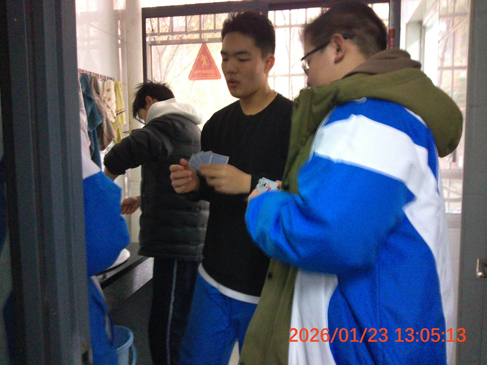
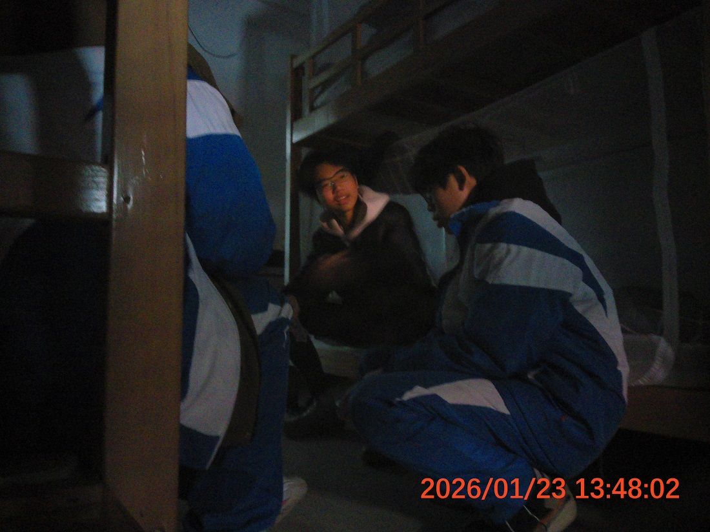
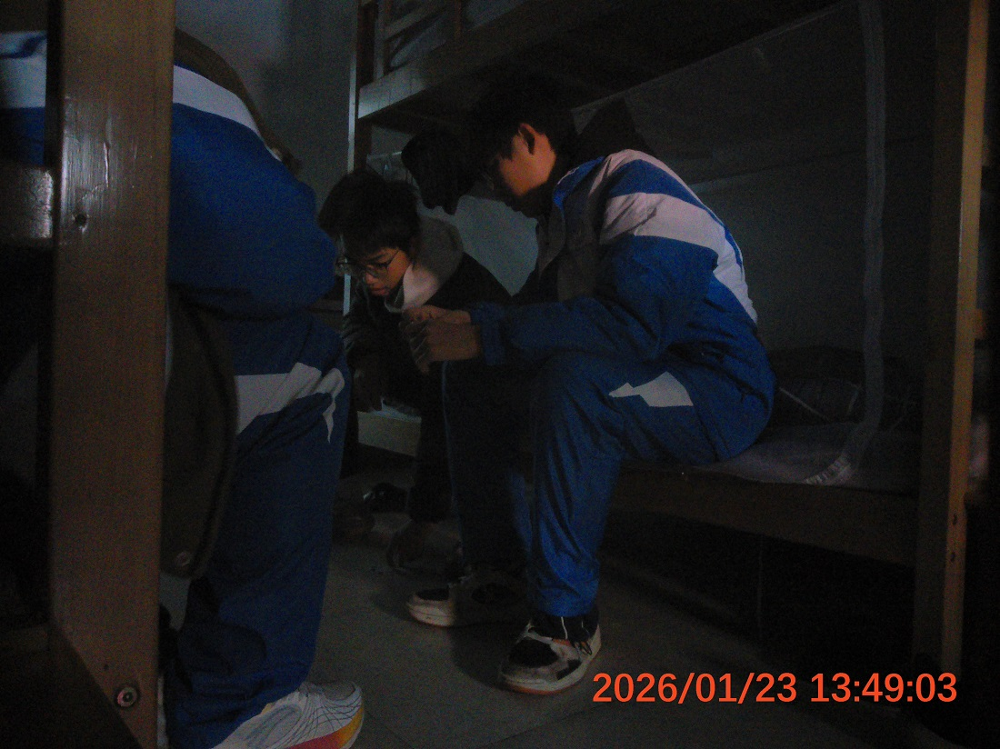

本报讯 今日午间，105寝室组织了一场小范围、非正式的棋牌交流活动。活动由寝室长刘昶同志牵头，成员刘健强、刘奇、刘拥祺等共同参与，并特邀104寝室代表李浩霖同志列席，旨在丰富课余文化生活，增进寝室间友好互动。

活动中，刘奇同志就“德州扑克”的基本规则与策略进行了详细介绍，为本次交流奠定了理论基础。与会成员随后围绕规则细节进行了坦诚而深入的探讨，现场气氛热烈而有序，体现了平等协商、友好交流的精神。

寝室长刘昶同志在活动后表示，此类健康有益的休闲活动，有助于营造团结、活泼的寝室氛围，是校园和谐文化建设的重要组成部分。列席代表李浩霖同志亦对本次活动给予积极评价，认为这为促进跨寝室交流与合作提供了良好范例。