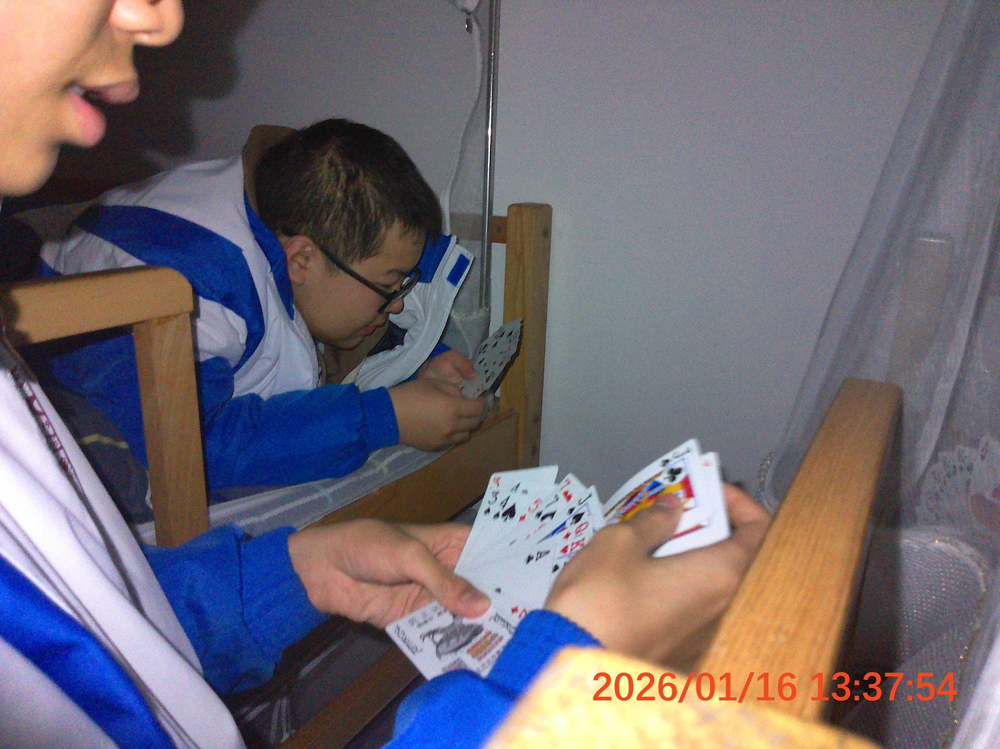

为深入领会 “54号文件”核心要义，推动寝室文化建设与学风建设相结合，1月16日午，105寝室组织开展了一场别开生面的“学习贯彻‘54号文件’精神专题研讨会”。会议通过集体研讨与互动交流相结合的形式，对文件内容进行了生动解读与探讨。

本次研讨会由105寝室长刘昶主持，成员刘拥祺、刘健强参与，并特邀104寝室代表李浩霖列席，共同围绕文件内涵展开学习。

会议伊始，刘昶强调了“54号文件”在学生自我减压、促进集体协作方面的重要意义，提出应结合寝室实际，将文件精神融入日常生活与学习中。

刘昶指出，2026年是“十五五”规划首年，105寝室为学校博彩行业重心，要将博彩行业与现代文化相结合，以新发展理念引领发展，加快培育新动能，促进结构优化升级，不断创新，推动105寝室博彩行业高质量发展。

      
会后，刘昶对下一步工作做出了部署。