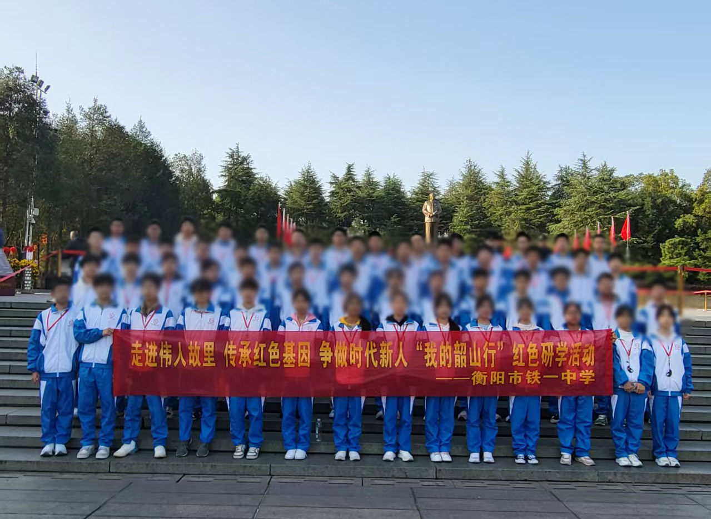
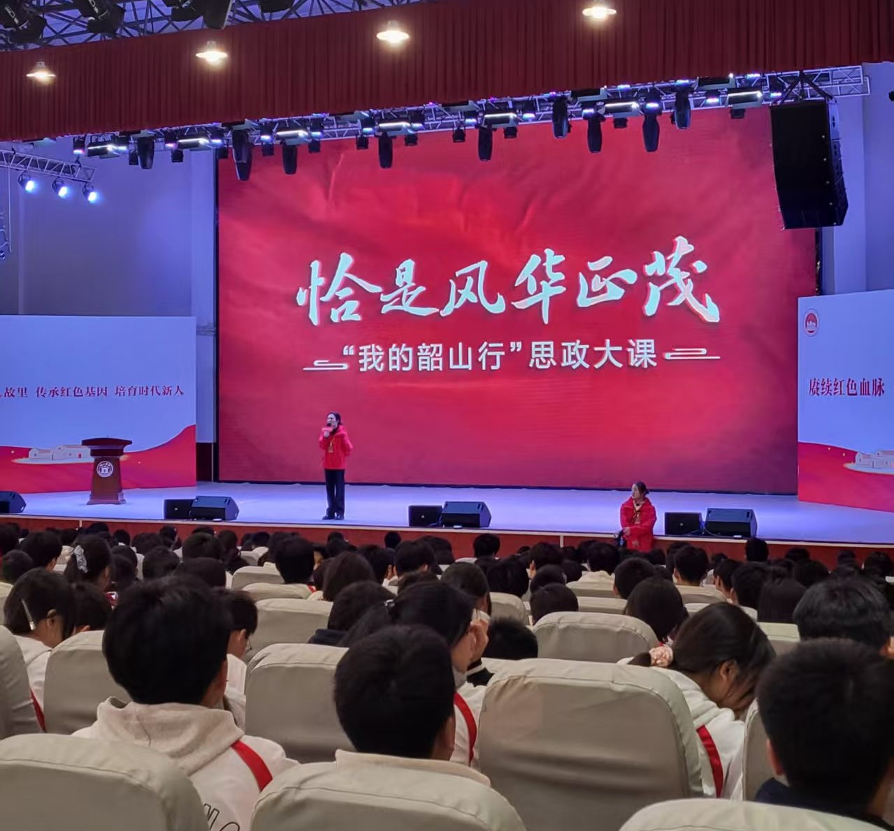
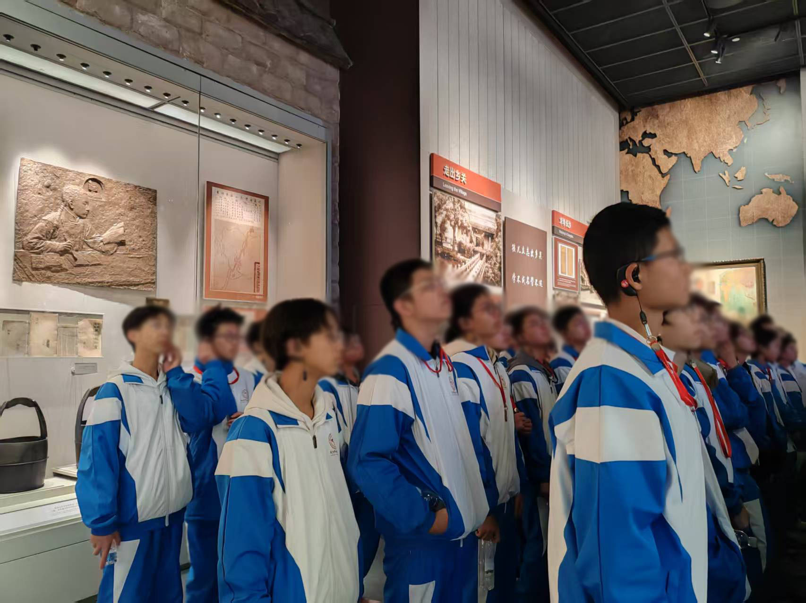
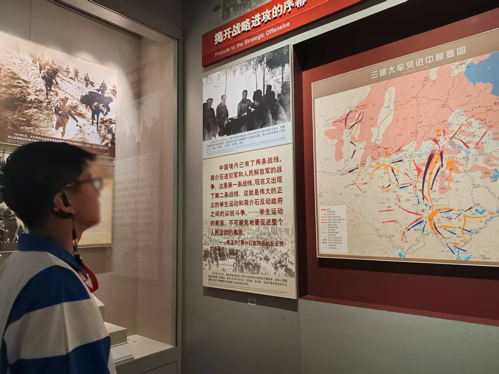
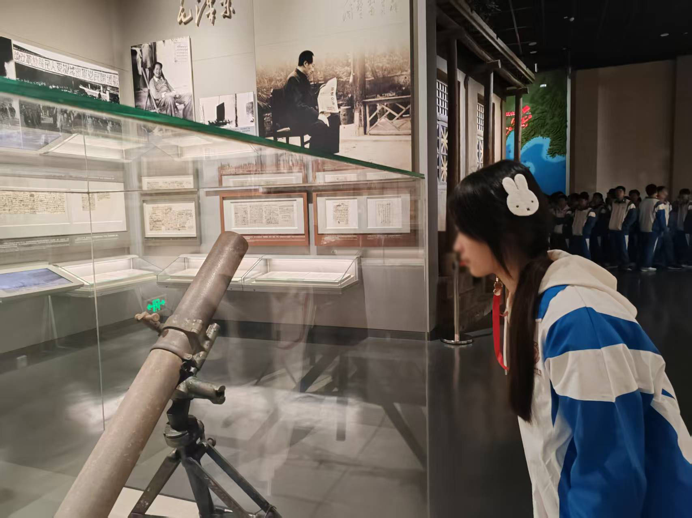

在金秋送爽的时节，衡阳市铁一中学5**班全体同学怀着崇敬之心踏上了一场特殊的红色研学之旅——“我的韶山行”。这场以“追寻伟人足迹，传承红色基因”为主题的实践教育活动，通过沉浸式场景体验与深度学习，让课本中的历史跃然眼前，在每位同学心中种下了信仰的种子。

# 庄严宣誓启征程，思政大课悟初心
当大巴车驶入韶山冲，远处毛泽东广场上巍峨的伟人铜像映入眼帘，同学们的肃穆之情油然而生。在开班仪式上，全体同学佩戴着鲜红的团徽，面向铜像高举右拳庄严宣誓：“请党放心，强国有我！”铿锵誓言回荡在广场上空，与秋风中的松柏共鸣。献花环节中，当洁白的花束轻轻放置在纪念台前，许多同学眼眶湿润，这一刻，历史与现实在时空交错中完成了精神的传承。

夜幕降临后的思政大课《恰是风华正茂》将学习推向高潮。学校报告厅内，通过全息投影技术重现的“恰同学少年”场景，配合专家生动的讲述，让同学们仿佛穿越回1910年的东山学堂。当看到青年毛泽东在油灯下抄写《世界英雄豪杰传》的影像时，同学们感慨道：“原来伟人的成长轨迹里，也藏着和我们一样的求知热忱，但不同的是他们始终将个人理想与民族命运紧密相连。”

# 故居寻根明志向，纪念馆里铸忠魂
次日清晨的毛泽东故居之行，让同学们对“为人民服务”的宗旨有了具象认知。斑驳的农具、简朴的陈设、泛黄的课本，这些承载着历史温度的物件，无声诉说着少年毛泽东如何在劳动中锤炼意志，在书香中培育家国情怀。

毛泽东同志纪念馆的参观则是一场震撼心灵的洗礼。从《论持久战》手稿到开国大典的珍贵影像，从延安窑洞的纺车到原子弹模型，每个展品都构成中国共产党百年奋斗的时空坐标。当看到“为人民服务”五个鎏金大字时，同学们自发驻足默立。有同学在参观笔记中记录：“这里陈列的不仅是文物，更是一个政党永葆生机的密码——始终与人民同呼吸、共命运。”

# 青春与信仰的双向奔赴
返程大巴上，同学们展开热烈讨论。有人分享着拍摄的200余张照片，有人诵读着摘抄的30余条金句，更多人则在思考如何将红色基因转化为成长动力。这次研学活动，不仅让5**班同学对韶山精神有了立体认知，更在三个维度实现了精神升华：在历史维度中读懂“从哪里来”，在现实维度中明确“向何处去”，在未来维度中思考“如何担当”。

作为新时代的青年学子，5**班全体同学在此次研学中达成共识：要将韶山之行收获的精神养分转化为学习动力，以“功成不必在我，功成必定有我”的担当，在实现中国梦的生动实践中书写青春华章。这或许正是红色研学最珍贵的意义——让信仰的种子在青春沃土生根发芽，终将长成参天大树。
