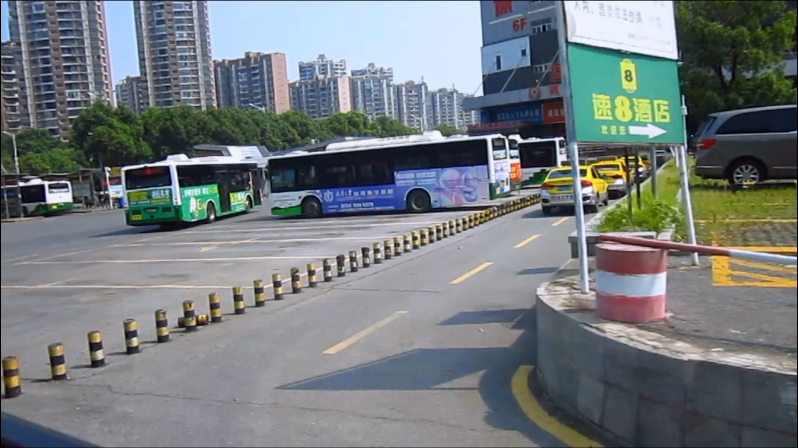
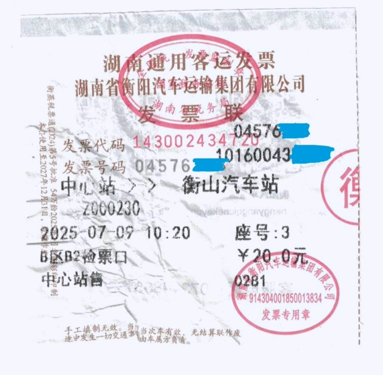
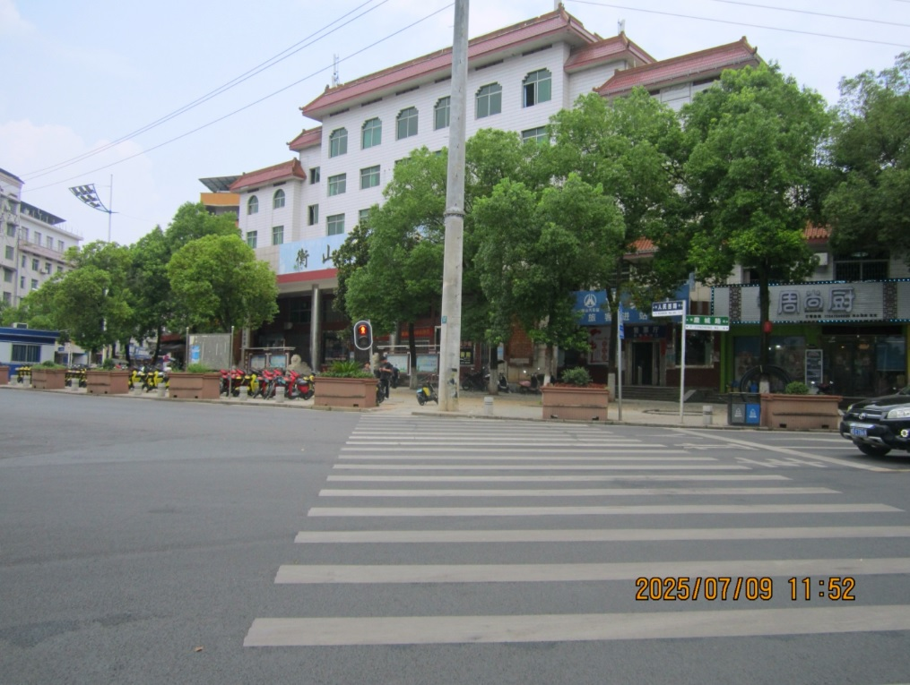
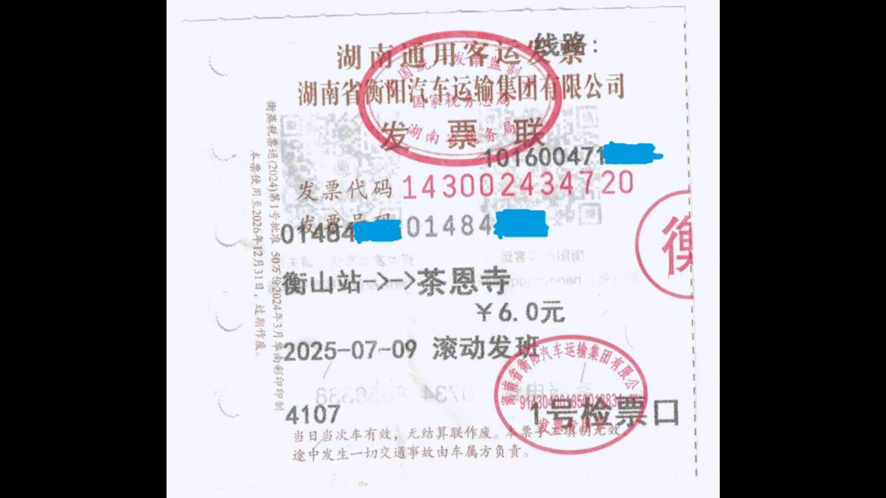
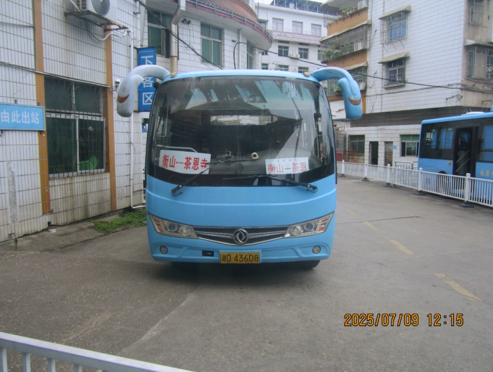
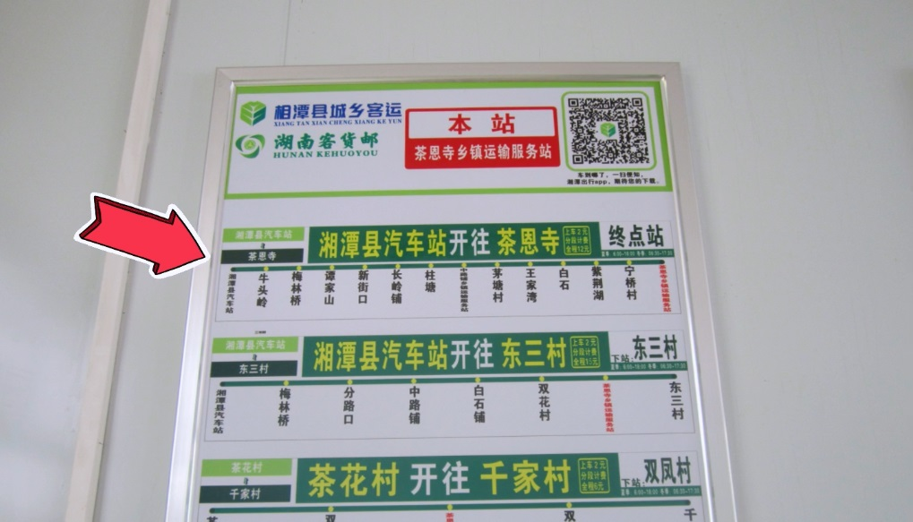
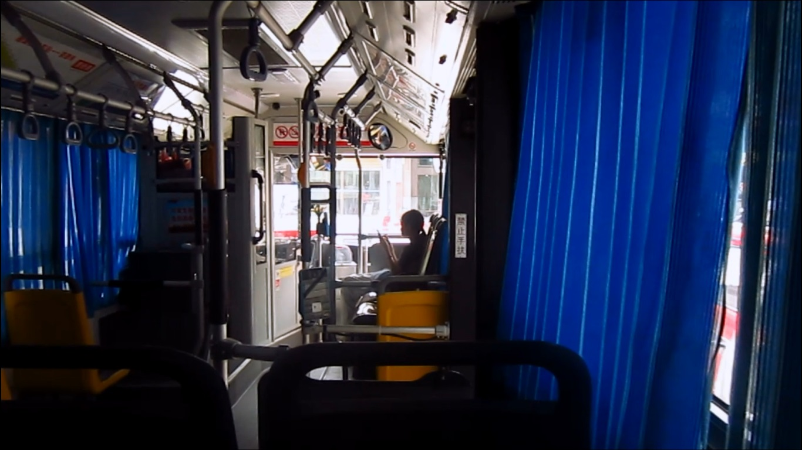

# 前言
实际上这已经是一年前的事了，但最近还是想写一篇文章来记录。

# 衡阳段
10点左右，我们乘142路到达了衡阳市中心汽车站。￥2

购买一张去衡山汽车站的城际206路的车票。￥20

11：30,我们到达了衡山汽车站

接下来去买一张到茶恩寺的车票，￥6

md害我等了40多分钟

A Few Moments Later...

# 湘潭段

13点，我们到达了茶恩寺。接下来我们要坐去湘潭县汽车站的城乡公交。￥12

13：20，从茶恩寺出发

……

到了湘潭县汽车站后，就可以乘坐602转K5路到湘潭北站，后乘地铁3号线去长沙。≈￥9

# 后记
本次行程共花费约8小时。

仅图一乐，坐火车比这快多了，车费也少不少~(￣▽￣)~*

