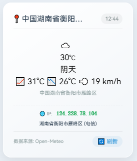

# 前言
前段时间让DeepSeek给我写了一个天气侧边栏组件，中途出了一堆错误，但好在最终还是成功了。

# 说明
|接口|用途|
|------|------|
|ipwho.is|获取IP地址，用于定位|
|Open-Meteo|获取天气数据|

## 效果图


# 组件代码
新建 `src/components/widget/WeatherSidebar.astro`
```astro
---
// src/components/WeatherSidebar.astro
// 天气侧边栏组件 - 使用普通脚本方式，兼容 Astro Islands

export interface Props {
  unit?: 'celsius' | 'fahrenheit';
  refreshInterval?: number;
  defaultCity?: string;
}

const { 
  unit = 'celsius',
  refreshInterval = 30,
  defaultCity = '上海'
} = Astro.props;

const tempUnit = unit === 'celsius' ? '°C' : '°F';
---

<div class="weather-sidebar-wrapper">
  <div class="weather-card" id="weather-widget" 
       data-unit={unit}
       data-temp-unit={tempUnit}
       data-refresh-interval={refreshInterval}
       data-default-city={defaultCity}>
    <div class="weather-header">
      <span class="city-name" id="city-name">📍 加载中...</span>
      <span class="update-time" id="update-time">--:--</span>
    </div>
    <div class="weather-body" id="weather-body">
      <div class="weather-loading">⏳ 加载天气中...</div>
    </div>
    <div class="weather-ip-info" id="weather-ip-info">
      <span class="ip-label">🌐 IP: </span>
      <span class="ip-value" id="ip-address">检测中...</span>
      <span class="ip-location" id="ip-location"></span>
    </div>
    <div class="weather-footer">
      <span>数据来源: Open-Meteo</span>
      <button class="refresh-btn" id="refresh-btn">🔄 刷新</button>
    </div>
  </div>
</div>

<style>
  .weather-sidebar-wrapper {
    position: sticky;
    margin-bottom: 2rem;
  }

  .weather-card {
    background: linear-gradient(145deg, #ffffff, #f0f4f8);
    border-radius: 16px;
    padding: 1.25rem;
    box-shadow: 0 10px 25px rgba(0, 0, 0, 0.08);
    border: 1px solid rgba(255, 255, 255, 0.8);
    backdrop-filter: blur(4px);
    transition: transform 0.2s ease, box-shadow 0.2s ease;
    font-family: system-ui, -apple-system, sans-serif;
    max-width: 260px;
    margin: 0 auto;
  }

  .weather-card:hover {
    transform: translateY(-2px);
    box-shadow: 0 14px 30px rgba(0, 0, 0, 0.12);
  }

  .weather-header {
    display: flex;
    justify-content: space-between;
    align-items: center;
    margin-bottom: 0.75rem;
    font-size: 0.9rem;
    color: #2c3e50;
    border-bottom: 1px solid rgba(0, 0, 0, 0.06);
    padding-bottom: 0.5rem;
  }

  .city-name {
    font-weight: 600;
    font-size: 0.95rem;
    white-space: nowrap;
    overflow: hidden;
    text-overflow: ellipsis;
    max-width: 140px;
  }

  .update-time {
    font-size: 0.65rem;
    color: #7f8c8d;
    background: rgba(0, 0, 0, 0.04);
    padding: 0.15rem 0.5rem;
    border-radius: 20px;
    white-space: nowrap;
  }

  .weather-body {
    min-height: 80px;
    display: flex;
    flex-direction: column;
    justify-content: center;
    align-items: center;
    padding: 0.5rem 0;
  }

  .weather-loading {
    color: #95a5a6;
    font-size: 0.9rem;
    animation: pulse 1.5s ease-in-out infinite;
  }

  @keyframes pulse {
    0%, 100% { opacity: 1; }
    50% { opacity: 0.4; }
  }

  .weather-info {
    display: flex;
    align-items: center;
    gap: 1rem;
    width: 100%;
    justify-content: center;
  }

  .weather-icon {
    font-size: 2.8rem;
    line-height: 1;
  }

  .weather-temp {
    font-size: 2.2rem;
    font-weight: 700;
    color: #1a2634;
    letter-spacing: -0.5px;
  }

  .weather-temp small {
    font-size: 1rem;
    font-weight: 400;
    color: #5d6d7e;
    margin-left: 2px;
  }

  .weather-desc {
    font-size: 0.85rem;
    color: #34495e;
    margin-top: 0.15rem;
    text-align: center;
    text-transform: capitalize;
  }

  .weather-details {
    display: flex;
    gap: 1.2rem;
    margin-top: 0.5rem;
    font-size: 0.75rem;
    color: #5d6d7e;
    justify-content: center;
    flex-wrap: wrap;
  }

  .weather-details span {
    display: flex;
    align-items: center;
    gap: 0.25rem;
  }

  .weather-ip-info {
    margin-top: 0.5rem;
    padding-top: 0.5rem;
    border-top: 1px dashed rgba(0, 0, 0, 0.08);
    font-size: 0.6rem;
    color: #95a5a6;
    display: flex;
    flex-wrap: wrap;
    gap: 0.3rem 0.5rem;
    justify-content: center;
    align-items: center;
  }

  .ip-label {
    color: #7f8c8d;
  }

  .ip-value {
    color: #3498db;
    font-weight: 600;
    font-family: monospace;
    font-size: 0.7rem;
  }

  .ip-location {
    color: #2c3e50;
    font-weight: 500;
  }

  .weather-footer {
    display: flex;
    justify-content: space-between;
    align-items: center;
    margin-top: 0.5rem;
    padding-top: 0.5rem;
    border-top: 1px solid rgba(0, 0, 0, 0.06);
    font-size: 0.6rem;
    color: #95a5a6;
  }

  .refresh-btn {
    background: none;
    border: none;
    color: #3498db;
    cursor: pointer;
    font-size: 0.7rem;
    padding: 0.15rem 0.6rem;
    border-radius: 12px;
    transition: background 0.2s;
    background: rgba(52, 152, 219, 0.08);
  }

  .refresh-btn:hover {
    background: rgba(52, 152, 219, 0.18);
  }

  .refresh-btn:active {
    transform: scale(0.95);
  }

  @media (prefers-color-scheme: dark) {
    .weather-card {
      background: linear-gradient(145deg, #2c3e50, #1a2634);
      border-color: rgba(255, 255, 255, 0.06);
    }
    .weather-header {
      color: #ecf0f1;
      border-bottom-color: rgba(255, 255, 255, 0.08);
    }
    .city-name { color: #ecf0f1; }
    .update-time { color: #b0bec5; background: rgba(255,255,255,0.06); }
    .weather-temp { color: #ffffff; }
    .weather-temp small { color: #b0bec5; }
    .weather-desc { color: #cfd8dc; }
    .weather-details { color: #b0bec5; }
    .weather-footer { color: #78909c; border-top-color: rgba(255,255,255,0.06); }
    .refresh-btn { color: #4fc3f7; background: rgba(79, 195, 247, 0.1); }
    .refresh-btn:hover { background: rgba(79, 195, 247, 0.2); }
    .weather-loading { color: #78909c; }
    .weather-ip-info { border-top-color: rgba(255,255,255,0.08); }
    .ip-value { color: #4fc3f7; }
    .ip-location { color: #cfd8dc; }
    .ip-label { color: #78909c; }
  }

  @media (max-width: 768px) {
    .weather-sidebar-wrapper {
      position: relative;
      top: 0;
      margin-bottom: 1rem;
    }
    .weather-card {
      max-width: 100%;
      padding: 1rem;
    }
  }
</style>

<script>
  console.log('🌤️ Weather组件脚本已加载');

  // 从 DOM 读取配置
  const widgetEl = document.querySelector('#weather-widget');
  const CONFIG = {
    unit: widgetEl?.dataset.unit || 'celsius',
    tempUnit: widgetEl?.dataset.tempUnit || '°C',
    refreshInterval: parseInt(widgetEl?.dataset.refreshInterval) || 30,
    defaultCity: widgetEl?.dataset.defaultCity || '上海'
  };

  console.log('📋 配置:', CONFIG);

  // 全局状态
  const state = {
    isLoading: false,
    timerId: null,
    locationCache: null,
    ipInfo: null
  };

  // DOM 元素引用
  let els = {};

  function getElements() {
    els = {
      updateTime: document.querySelector('#update-time'),
      body: document.querySelector('#weather-body'),
      cityName: document.querySelector('#city-name'),
      refreshBtn: document.querySelector('#refresh-btn'),
      ipAddress: document.querySelector('#ip-address'),
      ipLocation: document.querySelector('#ip-location')
    };
    console.log('📦 元素获取:', {
      updateTime: !!els.updateTime,
      body: !!els.body,
      cityName: !!els.cityName,
      refreshBtn: !!els.refreshBtn,
      ipAddress: !!els.ipAddress,
      ipLocation: !!els.ipLocation
    });
  }

  // ============================================================
  // API 函数
  // ============================================================

  /**
   * 获取 IP 信息和归属地
   */
  async function getIPInfo() {
    console.log('📍 getIPInfo 开始');
    
    if (state.locationCache) {
      const age = Date.now() - state.locationCache.timestamp;
      if (age < 60 * 60 * 1000) {
        console.log('📦 使用缓存的IP信息，缓存年龄:', Math.round(age / 60000), '分钟');
        return state.locationCache.data;
      }
    }

    try {
      console.log('📡 请求 xxapi.cn ...');
      const response = await fetch('https://v2.xxapi.cn/api/ip');
      console.log('📡 xxapi.cn 响应状态:', response.status);
      
      if (!response.ok) throw new Error('HTTP ' + response.status);
      const result = await response.json();
      console.log('📡 xxapi.cn 响应数据:', result);
      
      if (result.code === 200 && result.data) {
        const data = result.data;
        let address = data.address || '';
        let city = '';
        let region = '';
        
        if (address) {
          const match = address.match(/^中国(.+)$/);
          if (match) {
            city = match[1].trim();
            region = city;
          } else {
            city = address;
            region = address;
          }
        }

        const ipInfoData = {
          ip: data.ip || '未知IP',
          lat: parseFloat(data.lat) || 0,
          lon: parseFloat(data.lng) || 0,
          address: address,
          city: city,
          region: region,
          country: '中国',
          isp: data.isp || '未知运营商',
          raw: data
        };
        
        state.locationCache = { data: ipInfoData, timestamp: Date.now() };
        console.log('✅ xxapi.cn 获取IP信息成功:', ipInfoData);
        return ipInfoData;
      } else {
        throw new Error(result.msg || 'IP信息获取失败');
      }
    } catch (error) {
      console.warn('⚠️ xxapi.cn 获取IP失败:', error.message);
      console.log('📡 尝试备选方案 ip-api.com ...');
      
      try {
        const backupResponse = await fetch('https://ip-api.com/json/?fields=status,country,regionName,city,lat,lon,isp,query');
        console.log('📡 ip-api.com 响应状态:', backupResponse.status);
        
        if (backupResponse.ok) {
          const backupData = await backupResponse.json();
          console.log('📡 ip-api.com 响应数据:', backupData);
          
          if (backupData.status === 'success') {
            const ipInfoData = {
              ip: backupData.query || '未知IP',
              lat: backupData.lat,
              lon: backupData.lon,
              address: backupData.country + backupData.regionName + backupData.city,
              city: backupData.city,
              region: backupData.regionName,
              country: backupData.country,
              isp: backupData.isp || '未知运营商',
              raw: backupData
            };
            state.locationCache = { data: ipInfoData, timestamp: Date.now() };
            console.log('✅ ip-api.com 获取IP信息成功:', ipInfoData);
            return ipInfoData;
          }
        }
      } catch (e) {
        console.warn('⚠️ 备选方案也失败:', e.message);
      }
      
      console.log('⚠️ 所有IP定位均失败');
      return {
        ip: '获取失败',
        lat: null,
        lon: null,
        address: null,
        city: null,
        region: null,
        country: null,
        isp: null
      };
    }
  }

  /**
   * 根据城市名获取天气（通过地理编码）
   */
  async function getWeatherByCity(city) {
    console.log('🌤️ getWeatherByCity, 城市:', city);
    const geoUrl = 'https://geocoding-api.open-meteo.com/v1/search?name=' + encodeURIComponent(city) + '&count=1&language=zh';
    console.log('📡 地理编码URL:', geoUrl);
    
    const geoResponse = await fetch(geoUrl);
    console.log('📡 地理编码响应状态:', geoResponse.status);
    
    if (!geoResponse.ok) throw new Error('地理编码失败: ' + geoResponse.status);
    const geoData = await geoResponse.json();
    console.log('📡 地理编码响应:', geoData);
    
    if (!geoData.results || geoData.results.length === 0) {
      throw new Error('未找到城市: ' + city);
    }
    
    const location = geoData.results[0];
    console.log('📍 找到城市:', location.name, '坐标:', location.latitude, location.longitude);
    
    return getWeatherByCoords(location.latitude, location.longitude);
  }

  /**
   * 根据经纬度获取天气
   */
  async function getWeatherByCoords(lat, lon) {
    console.log('🌤️ getWeatherByCoords, 坐标:', lat, lon);
    const url = 'https://api.open-meteo.com/v1/forecast?latitude=' + lat + '&longitude=' + lon + '&current_weather=true&daily=weathercode,temperature_2m_max,temperature_2m_min&timezone=auto&forecast_days=1';
    console.log('📡 天气API URL:', url);
    
    const response = await fetch(url);
    console.log('📡 天气API 响应状态:', response.status);
    
    if (!response.ok) throw new Error('天气API错误: ' + response.status);
    const data = await response.json();
    console.log('📡 天气API 响应数据:', data);
    return data;
  }

  // ============================================================
  // 渲染函数
  // ============================================================

  /**
   * 更新 IP 信息显示
   */
  function updateIPDisplay(ipInfo) {
    console.log('📝 updateIPDisplay:', ipInfo);
    
    if (els.ipAddress) {
      els.ipAddress.textContent = ipInfo.ip || '获取失败';
      els.ipAddress.style.color = ipInfo.ip && ipInfo.ip !== '获取失败' ? '#27ae60' : '#e74c3c';
    }
    
    if (els.ipLocation) {
      let locationText = '';
      if (ipInfo.city) {
        locationText = ipInfo.city;
      }
      if (ipInfo.region && ipInfo.region !== ipInfo.city) {
        locationText = locationText ? locationText + ', ' + ipInfo.region : ipInfo.region;
      }
      if (ipInfo.country && ipInfo.country !== '中国') {
        locationText = locationText ? locationText + ', ' + ipInfo.country : ipInfo.country;
      }
      if (ipInfo.isp && ipInfo.isp !== '未知运营商') {
        locationText = locationText ? locationText + ' (' + ipInfo.isp + ')' : ipInfo.isp;
      }
      els.ipLocation.textContent = locationText || '未获取到归属地';
    }
  }

  /**
   * 渲染天气信息
   */
  function renderWeather(data, location, isDefault = false) {
    console.log('🎨 renderWeather 开始渲染, isDefault:', isDefault);
    const current = data.current_weather;
    if (!current) {
      throw new Error('无效的天气数据');
    }

    let temp = CONFIG.unit === 'fahrenheit' ? current.temperature * 9/5 + 32 : current.temperature;
    let tempDisplay = Math.round(temp);
    let weatherCode = current.weathercode || 0;
    let icon = getWeatherIcon(weatherCode);
    let desc = getWeatherDescription(weatherCode);

    let daily = data.daily || {};
    let highTemp = daily.temperature_2m_max?.[0] ?? null;
    let lowTemp = daily.temperature_2m_min?.[0] ?? null;
    let highDisplay = highTemp !== null ? (CONFIG.unit === 'fahrenheit' ? Math.round(highTemp * 9/5 + 32) : Math.round(highTemp)) : '--';
    let lowDisplay = lowTemp !== null ? (CONFIG.unit === 'fahrenheit' ? Math.round(lowTemp * 9/5 + 32) : Math.round(lowTemp)) : '--';

    let windSpeed = current.windspeed || 0;
    let windSpeedDisplay = CONFIG.unit === 'fahrenheit' ? Math.round(windSpeed * 0.621371) : Math.round(windSpeed);

    let displayName = location?.address || location?.city || location?.region || CONFIG.defaultCity;
    if (isDefault) {
      displayName = displayName + ' (默认)';
    }

    if (els.body) {
      els.body.innerHTML = `
        <div class="weather-info">
          <div class="weather-icon">${icon}</div>
          <div>
            <div class="weather-temp">${tempDisplay}<small>${CONFIG.tempUnit}</small></div>
            <div class="weather-desc">${desc}</div>
          </div>
        </div>
        <div class="weather-details">
          <span>📈 ${highDisplay}${CONFIG.tempUnit}</span>
          <span>📉 ${lowDisplay}${CONFIG.tempUnit}</span>
          <span>💨 ${windSpeedDisplay} ${CONFIG.unit === 'fahrenheit' ? 'mph' : 'km/h'}</span>
        </div>
        <div style="text-align:center;font-size:0.65rem;color:#95a5a6;margin-top:0.25rem;">
          ${displayName}
        </div>
      `;
      console.log('✅ 渲染完成');
    }
  }

  // ============================================================
  // 工具函数
  // ============================================================

  function getWeatherIcon(code) {
    const map = {
      0: '☀️', 1: '🌤️', 2: '⛅', 3: '☁️',
      45: '🌫️', 48: '🌫️',
      51: '🌦️', 53: '🌦️', 55: '🌧️',
      56: '🌧️', 57: '🌧️',
      61: '🌧️', 63: '🌧️', 65: '🌧️',
      66: '🌧️', 67: '🌧️',
      71: '🌨️', 73: '🌨️', 75: '❄️',
      77: '🌨️',
      80: '🌦️', 81: '🌧️', 82: '⛈️',
      85: '🌨️', 86: '❄️',
      95: '⛈️', 96: '⛈️', 99: '⛈️'
    };
    return map[code] || '🌡️';
  }

  function getWeatherDescription(code) {
    const map = {
      0: '晴天', 1: '晴间多云', 2: '多云', 3: '阴天',
      45: '雾', 48: '霜雾',
      51: '小毛毛雨', 53: '毛毛雨', 55: '大雨',
      56: '冻雨', 57: '冻雨',
      61: '小雨', 63: '中雨', 65: '大雨',
      66: '冻雨', 67: '冻雨',
      71: '小雪', 73: '中雪', 75: '大雪',
      77: '雪粒',
      80: '阵雨', 81: '中阵雨', 82: '大阵雨',
      85: '阵雪', 86: '大阵雪',
      95: '雷暴', 96: '雷暴加冰雹', 99: '强雷暴加冰雹'
    };
    return map[code] || '未知天气';
  }

  // ============================================================
  // 主逻辑
  // ============================================================

  /**
   * 获取天气主函数
   */
  async function fetchWeather(showLoading = true) {
    console.log('🔄 fetchWeather 开始, showLoading:', showLoading);
    
    if (state.isLoading) {
      console.log('⏳ 已有请求进行中，跳过');
      return;
    }
    state.isLoading = true;
    
    if (showLoading && els.body) {
      els.body.innerHTML = '<div class="weather-loading">⏳ 刷新中...</div>';
    }

    try {
      // 1. 获取 IP 信息
      console.log('📍 开始获取IP信息...');
      const ipInfo = await getIPInfo();
      console.log('📍 IP信息:', ipInfo);
      state.ipInfo = ipInfo;
      
      // 显示 IP 信息
      updateIPDisplay(ipInfo);
      
      // 2. 决定使用哪个城市
      let location = null;
      let isDefault = false;
      
      if (ipInfo && ipInfo.lat && ipInfo.lon && ipInfo.lat !== 0 && ipInfo.lon !== 0) {
        console.log('📍 使用IP定位的城市:', ipInfo.city);
        location = {
          lat: ipInfo.lat,
          lon: ipInfo.lon,
          address: ipInfo.address || ipInfo.city,
          city: ipInfo.city,
          region: ipInfo.region,
          country: ipInfo.country || '中国',
          ip: ipInfo.ip
        };
        isDefault = false;
      } else {
        console.log('📍 IP定位失败，使用默认城市:', CONFIG.defaultCity);
        isDefault = true;
      }
      
      // 3. 获取天气
      let weatherData;
      if (isDefault || !location) {
        console.log('🌤️ 使用默认城市获取天气:', CONFIG.defaultCity);
        weatherData = await getWeatherByCity(CONFIG.defaultCity);
        
        if (els.cityName) {
          els.cityName.textContent = '📍 ' + CONFIG.defaultCity + ' (默认)';
        }
      } else {
        console.log('🌤️ 使用IP定位获取天气, 坐标:', location.lat, location.lon);
        weatherData = await getWeatherByCoords(location.lat, location.lon);
        
        if (els.cityName) {
          const cityDisplay = location.address || location.city || location.region || '未知位置';
          els.cityName.textContent = '📍 ' + cityDisplay;
        }
      }
      
      console.log('🌤️ 天气数据:', weatherData);
      
      // 4. 渲染天气
      if (location && !isDefault) {
        renderWeather(weatherData, location, false);
      } else {
        renderWeather(weatherData, { city: CONFIG.defaultCity }, true);
      }

      // 5. 更新时间
      if (els.updateTime) {
        const now = new Date();
        els.updateTime.textContent = now.toLocaleTimeString('zh-CN', { hour: '2-digit', minute: '2-digit' });
        console.log('🕐 更新时间:', els.updateTime.textContent);
      }
      
      console.log('✅ 天气获取完成');
    } catch (error) {
      console.error('❌ 天气获取失败:', error);
      if (els.body) {
        els.body.innerHTML = `
          <div style="text-align:center;color:#e74c3c;font-size:0.85rem;padding:0.5rem;">
            ⚠️ 加载失败<br>
            <span style="font-size:0.7rem;color:#95a5a6;">${error.message || '请稍后重试'}</span>
          </div>
        `;
      }
      if (els.cityName && !els.cityName.textContent.includes('📍')) {
        els.cityName.textContent = '📍 加载失败';
      }
    } finally {
      state.isLoading = false;
    }
  }

  // ============================================================
  // 初始化
  // ============================================================

  function init() {
    console.log('🚀 初始化天气组件');
    
    // 获取 DOM 元素
    getElements();
    
    // 防止重复初始化
    if (window._weatherInitialized) {
      console.log('⚠️ 组件已初始化，跳过');
      return;
    }
    window._weatherInitialized = true;
    
    // 绑定刷新按钮事件
    if (els.refreshBtn) {
      els.refreshBtn.addEventListener('click', () => {
        console.log('🔄 用户点击刷新');
        fetchWeather(true);
      });
    }
    
    // 开始获取天气
    fetchWeather(false);
    
    // 设置定时自动刷新
    if (CONFIG.refreshInterval > 0) {
      state.timerId = setInterval(() => {
        console.log('⏰ 自动刷新');
        fetchWeather(false);
      }, CONFIG.refreshInterval * 60 * 1000);
      console.log('⏱️ 定时器已设置，间隔:', CONFIG.refreshInterval, '分钟');
    }
  }

  // 等待 DOM 加载完成后初始化
  if (document.readyState === 'loading') {
    document.addEventListener('DOMContentLoaded', init);
  } else {
    // DOM 已加载，立即初始化
    init();
  }
</script>
```

# 注册组件
在 `src/components/layout/SideBar.astro` 中导入：
```
// src/components/layout/SideBar.astro
import Schedule from "@/components/widget/WeatherSidebar.astro";
```
在 `componentMap` 中注册
```astro {8}
// src/components/layout/SideBar.astro
const componentMap = {
    profile: Profile,
    announcement: Announcement,
    categories: Categories,
    tags: Tags,
    // ...
    WeatherSidebar: WeatherSidebar,
    quoteOfTheDay: QuoteOfTheDay,
};
```
在 `src/types/config.ts` 中注册
```
// src/types/config.ts
export type WidgetComponentType =
  // ...
  | "WeatherSidebar";
```
在 `src/config/sidebarConfig.ts` 中添加
```
// src/config/sidebarConfig.ts
{
  type: "WeatherSidebar",
  enable: true,
  position: "top",
  showOnPostPage: false,
},
```

# 验证
```
pnpm dev
```

# 完成